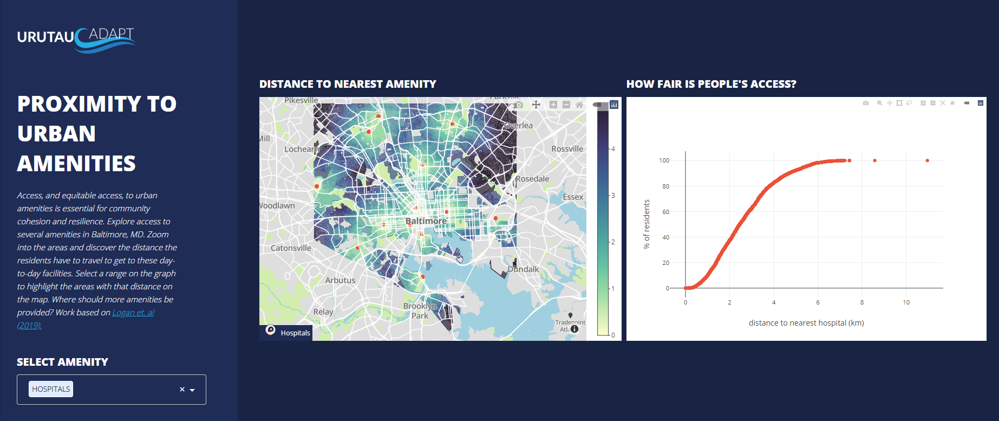

# Evaluating access to essential services

`dash-evaluating-proximity` is a simple dashboard enabling users to explore access to amenities in a city.
Areas with poor access can be highlighted by selecting the data on the graph.
This is developed using Dash and [Plotly](https//plot.ly/) and the template was modified from this [example](https://github.com/plotly/dash-sample-apps/tree/master/apps/dash-oil-gas-ternary).
It is based on the research by [Logan et. al (2019)](http://journals.sagepub.com/doi/10.1177/2399808317736528)

## Screenshots


## Requirements
As described in the [example that this is developed from](https://github.com/plotly/dash-sample-apps/tree/master/apps/dash-oil-gas-ternary), we suggest you to create a separate virtual environment running Python 3 for this app, and install all of the required dependencies there. Run in Terminal/Command Prompt:

```
git clone https://github.com/plotly/dash-sample-apps
cd dash-sample-apps/apps/dash-oil-gas-ternary
python3 -m virtualenv venv
```
In UNIX system:

```
source venv/bin/activate
```
In Windows:

```
venv\Scripts\activate
```

To install all of the required packages to this environment, simply run:

```
pip install -r requirements.txt
```

and all of the required `pip` packages, will be installed, and the app will be able to run.

## How to use the app
Run this app locally by:
```
python app.py
```
Open http://127.0.0.1:8050/ in your browser.

Alternatively, the app can be run from a remote server by running on the remote server:
```
python app.py --no-browser --port=8050
```
And on the local computer:
```
ssh -N -f -L localhost:8050:localhost:8050 user@remote-address
```
Then open http://127.0.0.1:8050/ in your browser.
